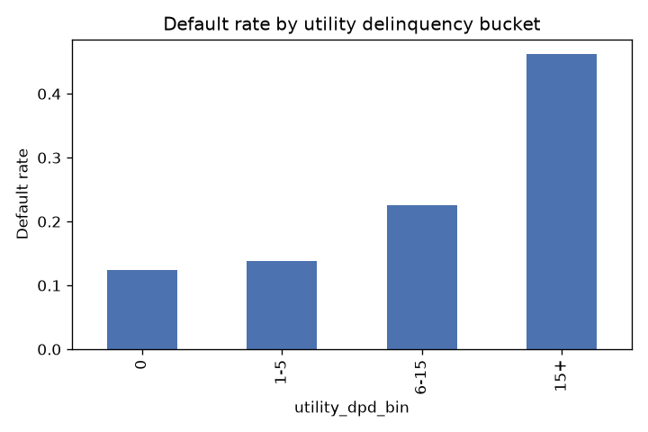
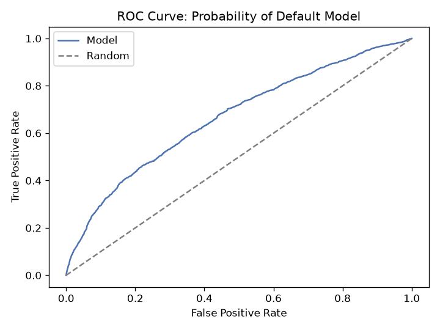
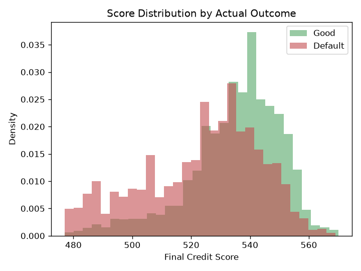
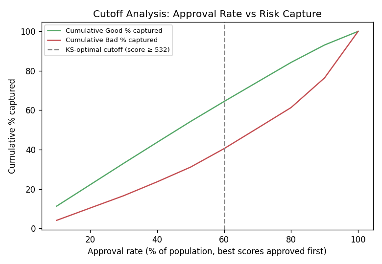

# Thin File Credit Underwriting Using Alternate Data

A credit risk scorecard for customers who have no traditional bureau history (CIBIL, Equifax) but do leave a digital and financial footprint through telecom, utility, and agricultural activity. Built end to end: synthetic data generation, statistical feature validation, Weight of Evidence feature engineering, logistic regression, a 300 to 900 point scorecard, and a Gini/cutoff-based decisioning layer to turn the model into an actual approve/decline line.


## Why this project exists

Most of India's rural and unbanked population has no CIBIL or Equifax score, so a standard credit model can't score them at all. Lenders who want to serve this segment have to build risk models on proxy signals instead: how consistently someone pays their electricity bill, how stable their crop yield has been across seasons, how often they top up their phone. This project builds that kind of model end to end, using the same statistical techniques (WoE, IV, PDO scaling) that traditional bureau-based scorecards use, just applied to a different set of features.

The dataset here is synthetic, generated with a known underlying risk relationship so the statistical tests and the model have something real to find. The pipeline itself, from raw feature to a 300 to 900 score, is the same one used in production credit scoring.

## Results

| Metric | Value |
|---|---|
| Customers scored | 10,000 |
| Default rate | 18.6% |
| Candidate features tested | 6 |
| Significant on Chi-Square + KS (p<0.05) | 4 |
| Features selected for modeling (IV >= 0.02) | 3 |
| Model | Logistic regression on WoE bins |
| ROC-AUC | 0.666 |
| Gini coefficient | 0.333 |
| Score range | 300 to 900 (PDO scaling, base 600 at 50:1 odds) |
| KS-optimal cutoff | score >= 532 (60% approval rate, 12.6% bad rate among approved) |

`utility_days_past_due` carried by far the strongest signal (IV around 0.30). `age` and `telecom_data_usage_gb` fell below the usefulness threshold and were dropped before modeling. One nuance worth calling out: `wallet_transaction_count` is statistically significant on both Chi-Square and KS, but its IV falls just under the 0.02 cutoff, significance alone doesn't mean a feature's effect size is worth the added model complexity, which is exactly why both checks are run.

**Default rate by utility delinquency bucket**



**Model discrimination**



**Score separates Good and Default populations**



**Cutoff analysis: where to draw the approve/decline line**



## Pipeline

```
Phase 1              Phase 2               Phase 3            Phase 4          Phase 5           Phase 6
Synthetic data   ->  Statistical      ->   WoE binning   ->   Logistic    ->   PDO scorecard ->   Risk decisioning
+ SQL join           validation            + IV filtering     regression       (300-900)          Gini + cutoffs
(data_generation.py) (statistical_tests.py)(woe_iv.py)        (modeling.py)    (scorecard.py)     (decisioning.py)
```

Everything is wired together in `src/pipeline.py` and runnable in one command from `main.py`.

## Project structure

```
thin-file-credit-scorecard/
├── main.py                    entry point, runs the full pipeline
├── src/
│   ├── config.py               all tunable constants in one place
│   ├── data_generation.py      Phase 1: synthetic data + SQL join
│   ├── statistical_tests.py    Phase 2: chi square, KS test
│   ├── woe_iv.py                Phase 3: WoE binning, IV, feature selection
│   ├── modeling.py             Phase 4: logistic regression, AUC
│   ├── scorecard.py            Phase 5: PDO scaling to a 300-900 score
│   ├── decisioning.py          Phase 6: Gini coefficient, cutoff analysis
│   └── pipeline.py             orchestrates all six phases, saves outputs
├── tests/                      pytest unit tests, one file per module
├── notebooks/                  exploratory notebook with the same pipeline, narrated
├── results/                    committed sample outputs (scored CSV, IV summary, model summary)
├── reports/figures/            committed sample plots
├── .github/workflows/ci.yml    runs tests + a full pipeline smoke test on every push
├── Dockerfile
└── requirements.txt
```

## Running it

```bash
git clone https://github.com/shyama7004/thin-file-credit-scorecard.git
cd thin-file-credit-scorecard
pip install -r requirements.txt
python main.py
```

This regenerates `results/scored_customers.csv`, `results/iv_summary.csv`, `results/feature_validation.csv`, `results/cutoff_analysis.csv`, `results/model_summary.txt`, and the four figures under `reports/figures/`.

To explore interactively instead, open `notebooks/thin_file_credit_scorecard.ipynb`, it walks through the same five phases with the business reasoning behind each step.

### With Docker

```bash
docker build -t thin-file-credit-scorecard .
docker run --rm -v $(pwd)/results:/app/results -v $(pwd)/reports:/app/reports thin-file-credit-scorecard
```

### With Make

```bash
make install
make test
make run
```

## Testing

Tests cover the statistical logic directly, not just that the pipeline runs without crashing: the PDO scaling formula is checked against its algebraic definition, the IV calculation is checked to rank a genuinely predictive synthetic feature above a genuinely random one, the Gini formula is checked against `2*AUC-1` at known points, and the cutoff table is checked for the monotonicity a real gains table should have (approval rate rising as more of the population is approved, bad rate never dropping as the cutoff loosens).

```bash
pytest tests/ -v
```

CI runs this matrix (Python 3.10, 3.11, 3.12) plus a full pipeline run on every push to `main`, so a change that breaks either the unit tests or the end to end run fails the build.

## Methodology notes

**Phase 1, data.** Five alternate data features are simulated: mobile recharge frequency, utility payment delinquency, telecom data usage, agricultural yield stability, and wallet transaction count. The `loan_default` target is generated from a weighted combination of these plus noise, so no single feature fully determines the outcome, the way a real portfolio behaves. Demographic data and vendor alternate data are kept in separate SQLite tables and joined with SQL, mirroring how these two data sources actually live in separate systems in production.

**Phase 2, statistical validation.** Before a feature earns a place in the model, it has to show it actually separates good customers from bad ones. Chi square tests categorical bins for independence from default. The Kolmogorov-Smirnov test measures how far apart the Good and Bad distributions of a continuous feature are. Both are run across every candidate feature at once (`validate_features`), that combined pass is the actual isolation step, not the single-feature demonstration alone.

**Phase 3, WoE and IV.** Weight of Evidence binning is the standard way to turn a raw feature into something a logistic regression can use monotonically and interpretably. Information Value summarizes how predictive the whole feature is, and features below IV 0.02 are dropped, the same threshold a real credit risk team would apply. Note that statistical significance (Phase 2) and effect size (IV) don't always agree, a feature can be significant but still too weak to be worth modeling with, which is exactly what happens to `wallet_transaction_count` in this run.

**Phase 4, modeling.** Logistic regression on WoE bins remains the backbone of most regulated credit scorecards, not because it is the most powerful model available, but because every coefficient and bin is explainable to a credit committee or a regulator. `statsmodels` is used specifically because it reports p-values and confidence intervals.

**Phase 5, scorecard.** The Points to Double the Odds method converts the model's log odds into a familiar three digit score:

```
Score = Offset + Factor * ln(Odds)
Factor = PDO / ln(2)
Offset = Base_Score - Factor * ln(Base_Odds)
```

Base score 600 at 50:1 odds, 20 points to double the odds, clipped to 300 to 900.

**Phase 6, risk decisioning.** ROC-AUC says the model discriminates, it doesn't say where to draw the approve/decline line. Gini (`2*AUC-1`) is reported because it's the number credit risk teams actually quote. The cutoff table sorts customers by score and walks down the population in deciles, showing the approval rate and resulting bad rate at each point, this is the real trade-off between growing the approved book and controlling losses. The KS-optimal cutoff (where cumulative Good% and Bad% separate the most) is offered as the statistically defensible starting point, but the actual cutoff a lender uses is a business decision shaped by risk appetite and capital, not something the model can pick on its own.

## What this does not cover

This is a modeling exercise, not a production underwriting system. Before this would ever touch a real lending decision it would need reject inference (this model only ever sees approved and observed outcomes), population stability monitoring over time, fair lending and disparate impact testing on protected classes, and an out of time validation sample rather than in sample AUC.

## License

MIT, see [LICENSE](LICENSE).
